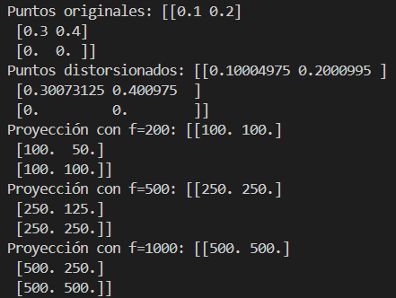
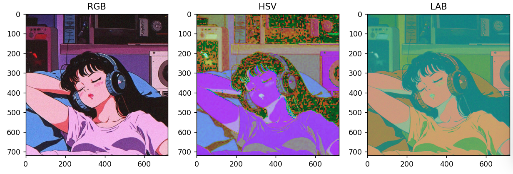
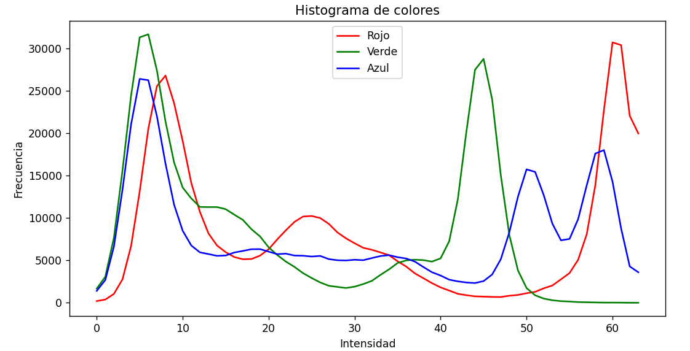
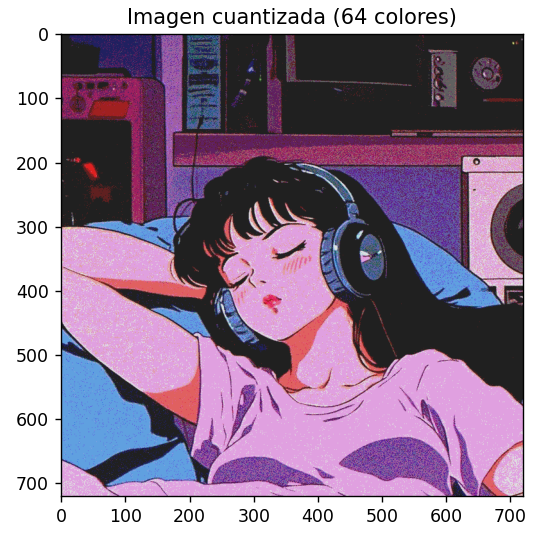
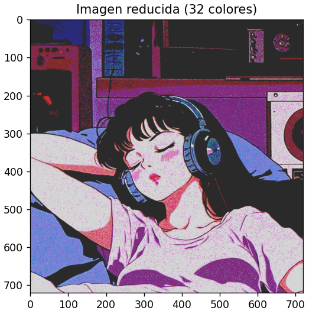
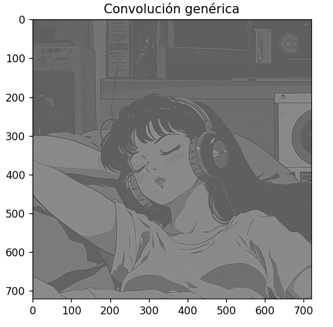
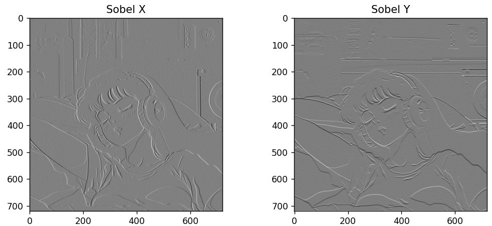
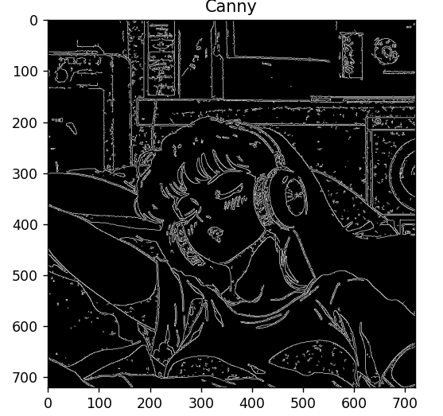
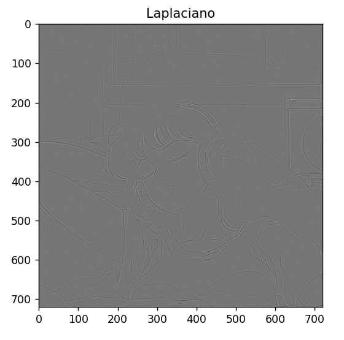

# Taller 1 - Visión por Computador

Este repositorio contiene la librería **cvtools**, un conjunto de funciones básicas de visión por computador para el Taller de la materia.  

Incluye ejemplos de uso en `main.py` y pruebas unitarias en la carpeta `tests/`.

---

## 📂 Estructura del proyecto

```text
computer-vision-taller/
├── cvtools/
│   ├── __init__.py
│   ├── camera.py       # Modelo pinhole y distorsión radial
│   ├── color.py        # Conversión de color, histograma, cuantización
│   └── filters.py      # Convolución, Sobel, Canny, Laplaciano
├── tests/
│   ├── test_camera.py
│   ├── test_color.py
│   └── test_filters.py
├── data/
│   ├── ejemplo1.jpeg
│   └── ejemplo2.jpeg
|── assets/             # Ejemplos visuales
│   ├── camera.png
│   ├── colores.png 
|   ├── histograma.png
|   ├── cuantizada64.png
|   ├── reducida32.png
|   ├── filtroconvoluciongenerica.png
|   ├── filtrosobel.png
|   ├── filtrocanny.png
|   └── filtrolaplaciano.png           
├── main.py             # Script demostrativo
├── requirements.txt    # Dependencias
└── README.md           # Documentación
```
## Instalación
```bash
git clone https://github.com/TU_USUARIO/computer-vision-taller.git
cd computer-vision-taller
```

### Instalar dependencias
```bash
pip install -r requirements.txt
```

## Uso de libreria
Ejecutar el script principal para ver ejemplos:
```bash
python main.py
```

```text
Esto mostrará:
- Proyecciones con modelo pinhole y distorsión radial (camera.py).
- Conversión de color (RGB → HSV, RGB → LAB), histogramas y cuantización (color.py).
- Convolución, filtros Sobel, Canny y Laplaciano (filters.py).
```
## 🖼️ Ejemplos visuales

### Ejemplos de camera
Puntos distorcionados y variación de longitud focal



### Conversión de color
De RGB a HSV y LAB:



### Histograma de colores
Distribución de intensidades por canal:



### Cuantización simple 
Reduce la imagen a 64 colores


### Reducción del peso de la imagen
Reduce la imagen a 32 colores


### Filtros

- Convolución genérica


- Sobel X, Sobel Y, Magnitud del gradiente


- Canny


- Laplaciano


## Pruebas unitarias
El proyecto incluye tests con unittest.
Para ejecutarlos desde la raíz del proyecto:

```bash
python -m unittest discover -s tests -v
```
Esto probará automáticamente todas las funciones implementadas.

## 🛠️ Funcionalidades implementadas

cvtools/camera.py
   apply_radial_distortion(points, k1, k2)
   project_points_pinhole(points_3d, f)

cvtools/color.py
   rgb_to_hsv(img)
   rgb_to_lab(img)
   color_histogram(img, bins, show)
   quantize_image(img, n_colors)
   reduce_image_size_by_color(img, n_colors)

cvtools/filters.py
   convolve2d(img, kernel, padding)
   sobel_x(img)
   sobel_y(img)
   canny(img, low, high)
   laplacian(img)

### 👩‍💻 Autor

Proyecto desarrollado por Valeria Fernanda Pillimue
Universidad del Rosario – Visión por computador